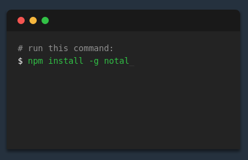
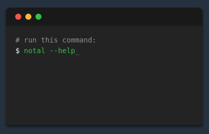

# Notal
[](https://github.com/sindresorhus/xo)
[](https://forthebadge.com)

> Package for memorizing and aliasing commands 💖💻💻💖

## Install


## Examples


## API
```
  Usage: notal [command name] OR [options]

  Options:

    -V, --version   output the version number
    -h, --help      output usage information

  Commands:

    list|l          List all the commands entered
    new|n [cmd]     Add new command entry
    edit|e [cmd]    Edit existing entry (uses default values from last revision)
    delete|d [cmd]  Delete existing entry
    clear|c         Clear all entries
    path|pa         Get path of config file (stored entries)
    print|p [cmd]   print an existing entry
    *               Execute the passed in command
```

## License
MIT © [Seth Parrish](https://setherizor.github.io)